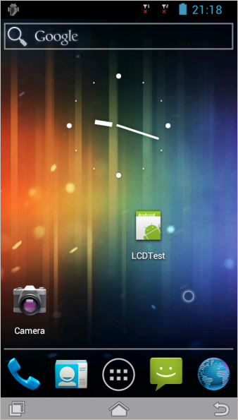

Seven Square
============

Android screencast written in QT. There is one in java? forget it from now on.

A tool used to view a mirror screen of your Android device on the PC, show a demonstration, debugging and so on. You can even click on the mirrored screen just as you touch on the device panel.

+ Tested hosts: Linux, Windows
+ Tested devices: QRD8x25/8x26, Linaro Panda board (OMAP4430), TCL Idol X (MTK6589)
+ Tested Android versions: 4.0, 4.1, 4.2

Features
--------

Major:

 * Click and swipe on the screen (so that you can unlock the screen by swipe)
 * Virtual menu/home/back key on the UI
 * QWERTY key support (just type via your keyboard)
 * Auto connect to your device when plugged in
 * Click on the window to wake up the device (emulate power key press event)
 * Support both Android ICS and Jelly Bean. Froyo not fully tested
 * Wrote in Qt 4.x, can be easily ported to a different desktop environment

Minor:

 * Rotate view windows on demand (Press F12)
 * Virtual cursor (pointer anchor) on the UI
 * Auto resize to fit the screen resolution of the device
 * Zoom window as your wish and maintain the aspect ratio
 * Support customized 'screencap' for speeding up (RGBA32, RGB888, RGB565)
 * Auto enable compressed data transfer if 'minigzip' is found on the host
 * 1~2FPS on MSM8625 devices (1.2G dual core, 512M memory, 800x480)

Not a feature yet:

 * Does not support multiple devices plugged in at the same time.
 * Does not support screen recording
 * Does not support taking screenshots

Additional Key Maps
==================

You can press F1/2/3/4 on your keyboard to emulate the following Android key.

 * For device:

        F1 AKEYCODE_HOME
        F2 AKEYCODE_BACK
        F3 AKEYCODE_CALL
        F4 AKEYCODE_ENDCALL

 * For application on PC:

        F12 Rotate view window (Landscape/Portrait)

Requirements
================

Mandatory
---------

 * Linux, any distribution with Qt package.

 * Qt 4.x+ installed in your system

 * screencap command on the target device

        $> adb shell ls /system/bin/screencap
        /system/bin/screencap

   If the output indicates: 'No such file or directory', you
   can use the tool except install one by yourself.

   the 'screencap' source code is present in frameworks/base/cmds/screencap.

 * PC: adb command is availible in your search path, check it:

        $> which adb
        /usr/bin/adb

 * USB cable connected to your Android device

Optional
--------

 * Android device in engineer mode (rooted), So that you can get
   root permission in ADB shell

        $> adb root
        $> adb shell id
        uid=0(root) gid=0(root)

 * minigzip installed on your PC (for compressed image transfer)
  
     There is a precompiled x86_64 minigzip binary in the contirbutes directory,
     just copy into your system path:

        $> sudo cp contributes/minigzip /usr/bin

     If you want to compile one for yourself, get it from android/external/zlib:

        $> cp -rf android/external/zlib zlib-pc
        $> cd zlib-pc
        $> ./configure
        $> make
        $> sudo cp minigzip /usr/bin

     It'll be appreciated If you can help add the decompression code into this project to help to avoid running external program 'minizip' to decompress frame buffer data.

 * Reduce screen data size generated by screencap

     Currently, we use 'screencap' command on the device to capture the screen
     content, bigger screen resolution causes more data to be transferred between the device
     and the host which causes more lag.

     I've added two options to the screencap which haven't been adopted by upstream yet. You can apply this patch to your source code to reduce the data
     size generated by screencap to reduce the transfer lag.

        $> cd frameworks/base/cmds/screencap
        $> patch -p3 < $PATH_TO_SEVENSQAURE/contributes/0001-Add-option-q-s-for-screencap-L/M/N.patch
        $> mm
        $> # Push new screencap to your device

    The original screencap outputs image in RGBA_8888 format, we add an option to
    convert it into RGB888/RGB565 to save transfer and compress time, which is already
    supported by current seven-square.

    New options:

       -q: quality preferred, will convert to RGB888. - 25% size reduced.
       -s: speed preferred, will convert to RGB565.   - 50% size reduced.

Compile
=======

Install dependences and just make:

    $> apt-get install qt4-qmake libqt4-dev libqtcore4 libqtgui4
    $> make

Run from source tree:

    $> ./build/seven-square

System-wide install:

    $> make install

Or you can create a shortcut on your desktop.

Keypad support
==============

 If you want to support to define more keys in the UI, please read
 the contributes/generate-keymap.sh for more info.

FAQ
===

 Q: Can I connect to my device via the network and using seven-square?
 A: Yes. Just use 'adb connect ...' to connect your device before
    running seven-square, make sure you can see it via 'adb devices',
    and you can run 'adb shell ls'

 Q: I noticed a lot of lag, can that be fixed?
 A: Try to follow the guideline in the 'Optional' section, which
    will help a bit on this issue.

History
=======

'Seven Square' was a game I played when I was a child, and I wrote a QT version
for it, in the branch sevensquare-game, [screenshot]:(screenshots/Screenshot-sq.png).
And now it's the base code of this tool.

Author
======

 Yang Hong <yanghong@thundersoft.com>

 Copyright reserved.

 Released under GPL2.

Contributors
============

 Eric Wang, Helped to port to the Windows platform

References
==========

 * Android screencast (Java)

   http://code.google.com/p/androidscreencast/

 * Droid@Screen (Java)

   http://blog.ribomation.com/droid-at-screen/
